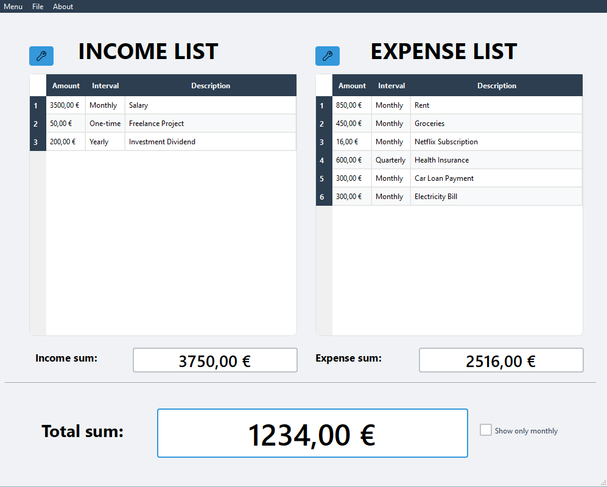

# Finance Manager

A personal finance tracking application built with Qt and C++.

Manage your income and expenses efficiently. Track your financial data over time and gain insights into your spending habits.

## Features

*   **Income & Expense Tracking:** Record and categorize your financial transactions.
*   **Data Visualization:** View your financial data in organized lists.
*   **Data Persistence:** Saves data locally in JSON format.
*   **Multi-language Support:** Available in multiple languages (e.g., English, German, French, Spanish, Dutch, Italian, Chinese, Japanese, Korean, Arabic).
*   **Multi-currency Support:** Manage finances in different currencies with automatic conversion.
*   **Automatic Backups:** Configurable automatic backup on exit.
*   **Settings Management:** Customize the application behavior (language, currency, date format, backup settings).
*   **Cross-Platform:** Built with Qt, aiming for compatibility across Windows, macOS, and Linux.

## Preview



## Installation

### From Release (Recommended - Windows)

1.  Visit the [Releases](https://github.com/rhewrani/Finance-Manager/releases) page.
2.  Download the latest `Setup_Finance_Manager_vX.X.X.exe`.
3.  Run the downloaded executable and follow the installer instructions.

### Building From Source

#### Prerequisites

*   C++ compiler (e.g., GCC, Clang, MSVC)
*   CMake (version 3.16 or higher)
*   Qt 6.x (or Qt 5.x, though Qt 6 is recommended)

#### Steps

1.  Clone the repository:
    ```bash
    git clone https://github.com/rhewrani/Finance-Manager.git
    cd Finance-Manager
    ```
2.  Create a build directory:
    ```bash
    mkdir build
    cd build
    ```
3.  Configure the project using CMake:
    ```bash
    cmake ..
    ```
    *   **Note:** If CMake cannot find Qt automatically, you might get an error like `Could not find a package configuration file provided by "QT"`. In this case, you need to tell CMake where Qt is installed.
    *   **Solution:** Add the `-DQT_DIR` parameter to specify the path to Qt's CMake configuration files.

    **Example (Windows, Qt 6.x installed in `C:\Qt\6.9.1\msvc2022_64`):**
    ```bash
    cmake .. -DQT_DIR="C:/Qt/6.9.1/msvc2022_64/lib/cmake/Qt6"
    ```
    *   **Important:**
        *   Replace `C:/Qt/6.9.1/msvc2022_64` with the actual path to your Qt installation.
        *   Ensure the path points to the directory containing `Qt6Config.cmake` (or `Qt5Config.cmake` for Qt 5).
        *   Use forward slashes (`/`) or double backslashes (`\\`) in the path.
4.  Build the project:
    ```bash
    cmake --build . --config Release
    ```
    *(Or use your IDE/build system generated by CMake, e.g., `make`, `ninja`, open `Finance_Manager.sln` in Visual Studio)*
5.  Copy template files:
    After a successful build, manually copy the `data.json` and `settings.json` files from the `src/templates` directory in the source code to the directory where the compiled `Finance_Manager.exe` executable is located (typically `build/` or `build/Release/`). These files contain the initial structure and default settings needed by the application.

The executable (`Finance_Manager.exe`) will be located in the build directory or a subdirectory like `src`.

## Usage

1.  Launch the application (`Finance_Manager.exe`).
2.  Use the interface to add income or expense entries.
3.  Navigate between views to see your data.
4.  Adjust settings via the settings menu as needed.

## Technologies Used

*   **C++:** Core programming language.
*   **Qt Framework:** For the graphical user interface and application logic.
*   **CMake:** Build system.
*   **JSON:** Data storage format.

## Contributing

Contributions are welcome! Please feel free to submit pull requests or open issues for bugs and feature requests.

## License

This project is licensed under the GNU General Public License v3.0 (GPL-3.0).

This application uses Qt, a cross-platform framework licensed under the GNU General Public License (GPL) version 3.
Qt is Copyright (C) 2025 The Qt Company Ltd. and other contributors.
You are free to use, modify, and redistribute Qt under the terms of the GPLv3.
The source code for Qt is available at: https://code.qt.io
As this application itself is licensed under the GPLv3, the complete source code for this application is also available under the terms of the GPLv3.
For details, see the full license: https://www.gnu.org/licenses/gpl-3.0.html

## Author

*   rhewrani
